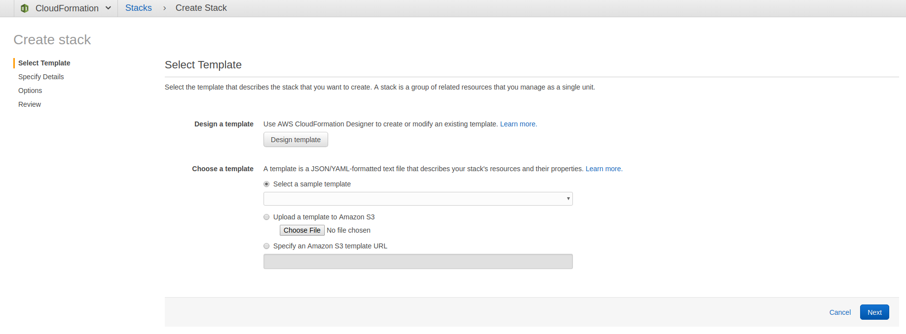
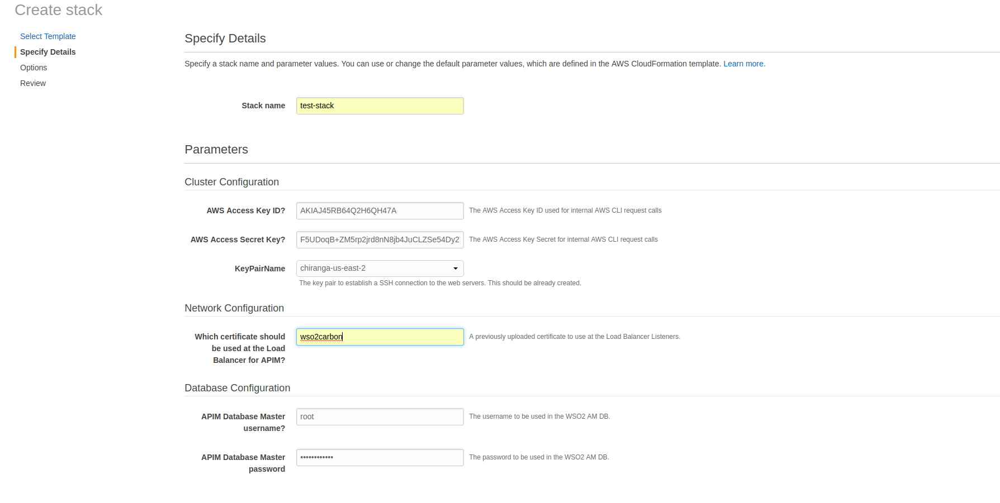
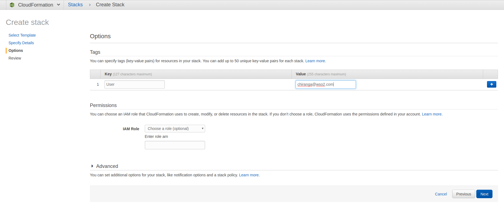
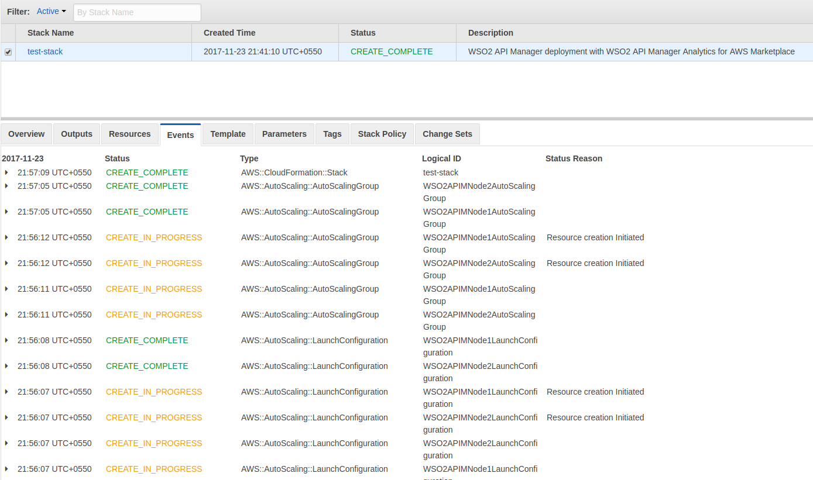

# AWS CloudFormation for WSO2 API Manager 2.2.0

This repository contains the CloudFormation template for WSO2 API Manager and resources required to create WSO2 API Manager and WSO2 API Manager Analytics Amazon Machine Images (AMIs).

## Quick Start Guide

### Create Amazon Machine Images (AMIs)

1. Clone this git repository and navigate to AMI directory:

   ```bash
   git clone https://github.com/wso2/cloudformation-apim
   cd cloudformation-apim/AMI
   ```

2. Set the AWS region required for creating the AMIs in the packer-conf.json file:

   ```json
   {
       "variables":
       {
           ...
           "region": "us-east-2",
           ...
       }
   }
   ```

Please note that `base-ami` must be set accordingly (`ami-25a97a4a` is for `us-east-2` only).

3. Create WSO2 API Manager AMI by executing the **create-AMI.sh** script as follows:

        bash create-AMI.sh -p APIM

4. Create WSO2 API Manager Analytics AMI by executing the **create-AMI.sh** script as follows:

        bash create-AMI.sh -p APIM-ANALYTICS

Please refer [Packer AMI Builder Reference Guide](https://www.packer.io/docs/builders/amazon-ebs.html) for updating desired configurations in Packer builder configuration.

### Create a stack using CloudFormation template

1. Go to AWS Management Console.

2. Choose **Services** -> **Management Tools** -> **CloudFormation** service.

3. Choose to **Create new stack**.

4. Under **Select Template** tab, go to **Choose a template** and choose **Upload a template to Amazon S3** option.
Then, choose the template file of your choice from **patterns** directory (e.g. **patterns/pattern-<number>/pattern-<number>-cloudformation.template.yaml**).

5. Select **Next**, after choosing the template file.



6. Enter a desired **Stack name**.

7. Under parameters,

    7.1. Enter your **AWS Access Key ID**.

    7.2. Enter your **AWS Access Key Secret**.

    7.3. Choose a desired AWS key pair name of your choice, belonging to the region in which you are running the stack.

    7.4. Enter 'wso2carbon' as the certificate at the load balancer for APIM.

    7.5. If desired, change the WSO2 APIM database master username and/or master password.

8. Select **Next**.



9. [Optional] Enter tag(s), if desired.

10. Select **Next**.



11. Choose to **Create**.

You will be able to see the progress of resource creation using **Events** tab.



### Verify the deployment

1. You can confirm whether the stack was created successfully by checking the **Status**.


2. Check the output of the deployment using the **Outputs** tab.


This tab contains URLs to WSO2 API Manager service store and publisher and an URL to WSO2 API Manager Analytics Management Console.

**Note**: The services available through above URLs may take a few minutes to become available, after stack creation.
